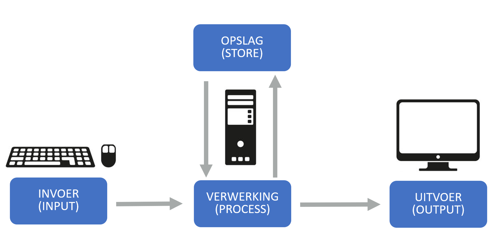

# Computer architectuur

Q-highschool / Computerarchitectuur / Bijeenkomst 3

***

## Welkom bij de online les!

**Vandaag:**

- Hoe is een computer opgebouwd?
- Wat zijn de belangrijkste onderdelen?
- Hoe werken deze onderdelen samen?

<div class="fragment" style="font-size:0.7em">

**Werkwijze:**
- Korte uitleg per onderwerp
- Zelfstandig werken aan opdrachten
- Korte uitwisselmomenten
- Stel vragen in de chat!

</div>

---

## Terugblik

**Week 1:** Binair rekenen
- Omrekenen tussen binair en decimaal
- Optellen, negatieve getallen, hexadecimaal

**Week 2:** Logische schakelingen
- Basispoorten (AND, OR, XOR, NOT)
- Samengestelde poorten
- Half-adder en optellen in hardware

Notes:

Duur: 3 minuten.

---

## De brug

Van bits naar rekenen:
- **Week 1:** Hoe computers getallen voorstellen
- **Week 2:** Hoe computers rekenen met hardware
- **Week 3 (vandaag):** Hoe de complete computer is georganiseerd

De logische poorten die je hebt gebouwd zitten echt in een processor!

Notes:

Duur: 2 minuten. Laat zien hoe alles samenhangt.

***

## Vandaag: Von Neumann architectuur

Vandaag leer je:

1. Het Von Neumann principe (invoer, verwerking, opslag, uitvoer)
2. Wat een processor doet (CPU, ALU, CU, registers)
3. Hoe geheugen werkt (RAM, adressen)
4. Hoe alles samenwerkt (fetch-decode-execute cyclus)

Notes:

Duur: 2 minuten.

***

# Het Von Neumann principe

***

## Wat is een computer?

Een **computer** is een apparaat dat:
- **Invoer** kan ontvangen
- Deze invoer kan **verwerken** met **opgeslagen** instructies
- Het resultaat als **uitvoer** kan geven

Dit heet het **Von Neumann principe**

Notes:

Duur: 2 minuten. Leg het basisprincipe uit.

---

## De vier onderdelen



Notes:

Duur: 3 minuten. Leg uit hoe deze vier onderdelen samenwerken.

---

## Voorbeeld: Een letter typen

1. **Invoer:** Je drukt op de 'A' toets
2. **Verwerking:** Processor berekent welke pixels op het scherm aangezet moeten worden aan de hand van de informatie in de **opslag**
3. **Opslag:** Hier staan de instructies en gegevens.
4. **Uitvoer:** De 'A' verschijnt op je scherm

Alles in je computer werkt volgens dit principe!

Notes:

Duur: 2 minuten. Maak het concreet.

***

## Werkblok 1: Het grote plaatje
<!-- .slide: style="font-size: 0.85em" -->

**Opdracht:**

Ga naar de syllabus, hoofdstuk "Architectuur", paragraaf "Introductie"

1. Lees de tekst over de geschiedenis van computers
2. Bekijk de figuren en video's
3. Maak de oefening: benoem de onderdelen in het figuur
4. Schrijf op: Wat zijn de vier onderdelen van het Von Neumann principe?

**Daarna:** Deel in de chat:
- Één ding dat je verrassend vond
- Wat vind je het belangrijkste onderdeel en waarom?

Notes:

Duur: 12 minuten totaal (8 werk + 2 uitwisseling + 2 bespreking).

Opdracht: 20 minuten zelfstandig werken.
Daarna: 2 minuten delen in de chat.

Laat iedereen zelfstandig werken. Monitor de chat voor vragen.

***

## Uitwisseling

**Deel je bevindingen:**

- Wat vond je verrassend aan de geschiedenis?
- Welk onderdeel vind je het belangrijkste?
- Waren er dingen die onduidelijk waren?

Notes:

Duur: 2 minuten.

Laat een paar mensen hun antwoorden delen.

***

# De Processor (CPU)

***

## Wat is een processor?

De **Central Processing Unit (CPU)** <br/>is het brein van de computer

De CPU:
- Voert alle berekeningen uit
- Stuurt alle andere onderdelen aan
- Werkt razendsnel (miljarden instructies per seconde!)

Notes:

Duur: 3 minuten.

---

## Transistoren

De processor bestaat uit **transistoren**

Een transistor is een elektronische schakelaar:
- Stroom door = 1
- Geen stroom = 0

Moderne processors hebben **miljarden** transistoren!

Notes:

Duur: 2 minuten. Leg uit dat dit de logische poorten zijn van week 2.

---

## Wet van Moore

**Voorspelling van Gordon Moore (1965):**

> Het aantal transistoren op een chip verdubbelt elke 2 jaar

Dit betekent: de rekenkracht verdubbelt elke 2 jaar!

Deze wet heeft zo'n 50 jaar gewerkt, maar raakt nu aan zijn limieten (transistoren zijn nu enkele atomen groot)

Notes:

Duur: 2 minuten. Dit is interessante achtergrondinformatie.

---

## Onderdelen van de CPU

De processor heeft drie belangrijke onderdelen:

1. **ALU** (Arithmetic Logic Unit) - doet berekeningen
2. **CU** (Control Unit) - bestuurt alles
3. **Registers** - tijdelijke opslag

Notes:

Duur: 2 minuten. Introduceer de drie onderdelen.

---

## ALU - Arithmetic Logic Unit

De **ALU** kan rekenen:
- Optellen en aftrekken
- Vermenigvuldigen en delen
- Logische operaties (AND, OR, XOR - week 2!)
- Vergelijkingen (groter dan, kleiner dan)

Dit is waar je half-adder van week 2 in zit!

Notes:

Duur: 2 minuten. Maak de link met week 2.

---

## CU - Control Unit

De **Control Unit** is de dirigent:
- Haalt instructies op uit het geheugen
- Decodeert de instructie (wat moet er gebeuren?)
- Stuurt de ALU aan
- Slaat resultaten op

De CU zorgt dat alles in de goede volgorde gebeurt

Notes:

Duur: 2 minuten.

---

## Registers

**Registers** zijn supersnelle geheugenplekjes in de CPU

Belangrijke registers:
- **Accumulator:** bewaart tijdelijk het resultaat van berekeningen
- **Program Counter:** houdt bij welke instructie nu uitgevoerd wordt
- **Instruction Register:** bevat de huidige instructie

Notes:

Duur: 2 minuten.

***

## Werkblok 2: De processor
<!-- .slide: style="font-size: 0.85em" -->

**Opdracht:**

Ga naar de syllabus, hoofdstuk "Architectuur", paragraaf "De processor"

1. Lees de tekst over transistoren en de processor
2. Bestudeer het schema van een CPU
3. Beantwoord voor jezelf:
   - Wat is de rol van de ALU?
   - Wat is de rol van de CU?
   - Wat is de rol van de registers?
4. Maak een eigen tekening/schema van een CPU met labels

**Let op:** Je mag vragen stellen in de chat!

Notes:

Duur: 17 minuten totaal (6 uitleg + 11 werk).

Opdracht: 25 minuten zelfstandig werken.

Loop door de online omgeving. Beantwoord vragen in de chat.

***

## Uitwisseling: De processor

**Bespreek samen:**

- Leg aan elkaar uit wat de ALU doet
- Leg aan elkaar uit wat de CU doet
- Bespreek: waarom zijn registers nodig?

Notes:

Duur: 3 minuten.

Gesprek met de hele groep. Laat ze kort aan elkaar uitleggen wat ze geleerd hebben.

***

# Geheugen (RAM)

***

## Wat is geheugen?

**RAM** = Random Access Memory = werkgeheugen

Het geheugen:
- Slaat tijdelijk data en instructies op
- Wordt gewist als de computer uitgaat
- Is georganiseerd in "vakjes" met adressen

Notes:

Duur: 2 minuten.

---

## Adressen in het geheugen

Elk vakje in het geheugen heeft een **adres**

```
Adres    Inhoud
0x0000:  00101010
0x0001:  11110000
0x0002:  10101100
0x0003:  00001111
...
```

De CPU kan elk vakje opvragen met zijn adres

Notes:

Duur: 2 minuten. Leg uit dat hexadecimaal vaak gebruikt wordt voor adressen.

---

## Bits, Bytes, en grootte

Een **byte** = 8 bits

Geheugengroottes:
- **KB** (Kilobyte) = 1024 bytes
- **MB** (Megabyte) = 1024 KB
- **GB** (Gigabyte) = 1024 MB

Moderne computers hebben 8-32 GB RAM

Notes:

Duur: 2 minuten.

---

## Wat staat er in het geheugen?

Het geheugen bevat:
- **Instructies** (wat moet de CPU doen?)
- **Data** (getallen, tekst, pixels, etc.)

De CPU weet door de context wat iets betekent!

Notes:

Duur: 1 minuut. Dit is belangrijk: dezelfde bits kunnen instructie of data zijn.

***

## Werkblok 3: Geheugen
<!-- .slide: style="font-size: 0.85em" -->

**Opdracht:**

Ga naar de syllabus, hoofdstuk "Architectuur", paragraaf "Geheugen"

1. Lees de tekst over geheugen en adressen
2. Bekijk de voorbeelden van geheugenadressen
3. Maak de oefeningen over geheugen
4. Beantwoord voor jezelf:
   - Wat is het verschil tussen RAM en ROM?
   - Waarom heeft elk vakje een adres?
   - Hoeveel bytes zijn er in 1 MB?

**Klaar?** Werk alvast aan de verdiepingsvragen!

Notes:

Duur: 12 minuten totaal (4 uitleg + 8 werk).

Opdracht: 20 minuten zelfstandig werken.

***

# De Fetch-Decode-Execute cyclus

***

## Hoe werkt de computer?

De CPU werkt in een **oneindige lus**:

1. **Fetch:** Haal de volgende instructie op uit het geheugen
2. **Decode:** Begrijp wat de instructie betekent
3. **Execute:** Voer de instructie uit

Dit gebeurt miljarden keren per seconde!

Notes:

Duur: 2 minuten. Dit is het kernprincipe.

---

## 1. Fetch (Ophalen)

De **Control Unit**:
- Kijkt in de **Program Counter** (welk adres?)
- Haalt de instructie op van dat adres in het geheugen
- Zet de instructie in het **Instruction Register**
- Verhoogt de Program Counter met 1

Notes:

Duur: 2 minuten.

---

## 2. Decode (Decoderen)

De **Control Unit**:
- Leest de instructie uit het Instruction Register
- Begrijpt wat er moet gebeuren
- Bepaalt welke onderdelen nodig zijn (ALU? Geheugen?)
- Bereidt alles voor

Notes:

Duur: 2 minuten.

---

## 3. Execute (Uitvoeren)

De **ALU** of een ander onderdeel:
- Voert de instructie uit
- Slaat het resultaat op in de Accumulator
- Het resultaat kan terug naar het geheugen
- En dan opnieuw: Fetch, Decode, Execute...

Notes:

Duur: 2 minuten.

---

## Voorbeeld: Tel 5 + 3 op

<div  style="font-size:0.7em; text-align: left; border: 1px solid black; padding-left: 10px; margin: 5px;">

**Fetch:** Haal instructie "LOAD 5" op

**Decode:** Dit betekent: laad getal 5 in de accumulator

**Execute:** Zet 5 in de accumulator

</div>

<div class="fragment" style="font-size:0.7em; text-align: left; border: 1px solid black; padding-left: 10px; margin: 5px">

**Fetch:** Haal instructie "ADD 3" op

**Decode:** Dit betekent: tel 3 op bij de accumulator

**Execute:** 5 + 3 = 8, zet 8 in de accumulator

</div>
<div class="fragment" style="font-size:0.7em; text-align: left; border: 1px solid black; padding-left: 10px; margin: 5px">

**Fetch:** Haal instructie "STORE" op

**Decode:** Dit betekent: sla de accumulator op in het geheugen

**Execute:** Zet 8 in een geheugenvakje

</div>
Notes:

Duur: 3 minuten. Loop dit voorbeeld stap voor stap door.

***

## Werkblok 4: De cyclus
<!-- .slide: style="font-size: 0.85em" -->

**Opdracht:**

Ga naar de syllabus, hoofdstuk "Architectuur", vervolg

1. Lees de tekst over de fetch-decode-execute cyclus
2. Bestudeer de voorbeelden van instructies
3. Probeer zelf een voorbeeld te bedenken:
   - Welke stappen doorloopt de computer?
   - Wat gebeurt er in de fetch fase?
   - Wat gebeurt er in de decode fase?
   - Wat gebeurt er in de execute fase?

**Schrijf je voorbeeld uit!** Dit helpt je het te begrijpen.

Notes:

Duur: 17 minuten totaal (6 uitleg + 11 werk).

Opdracht: 25 minuten zelfstandig werken.

***

## Uitwisseling: De cyclus

**In de hoofdroom:**

- Wie kan een voorbeeld delen van een fetch-decode-execute cyclus?
- Wat vond je moeilijk te begrijpen?
- Zijn er nog vragen?

Notes:

Duur: 3 minuten.

Laat een paar mensen hun voorbeelden delen.

---

## Alles gebeurt tegelijk

Terwijl je dit leest:
- Haalt de CPU instructies op uit het geheugen
- Voert de ALU berekeningen uit
- Worden pixels op je scherm ververst
- Luistert het toetsenbord naar je vingers

Miljarden keren per seconde!

Notes:

Duur: 2 minuten. Maak het indrukwekkend.

***

## Werkblok 5: Herhaling en verdieping
<!-- .slide: style="font-size: 0.85em" -->

**Kies wat je wilt doen:**

<div style="font-size: .7em">

**Optie 1: Herhalen**
- Maak de oefeningen uit de syllabus
- Teken je eigen schema's van de architectuur
- Schrijf in je eigen woorden wat elk onderdeel doet

</div>
<div style="font-size: .7em">

**Optie 2: Verdiepen**
- Ga naar "Verdieping architectuur" in de syllabus
- Lees over cache, meerdere kernen, pipelining
- Kijk naar moderne processorarchitecturen

**Stel vragen in de chat!**
</div>
Notes:

Duur: 9 minuten.

Geef leerlingen de keuze. Sommigen hebben herhaling nodig, anderen willen meer diepgang.

***

## Reflectie

**Denk na over vandaag:**

- Wat heb je geleerd?
- Wat vond je het moeilijkste onderwerp?
- Wat vond je het interessantste?
- Welke vragen heb je nog?

**Deel in de chat:** Eén ding dat je vandaag geleerd hebt

Notes:

Duur: 3 minuten.

Laat iedereen zijn belangrijkste leerpunt delen.

---

## Wat heb je geleerd?

**Vandaag:**
- Het Von Neumann principe (invoer, verwerking, opslag, uitvoer)
- De processor (CPU, ALU, CU, registers)
- Het geheugen (RAM, adressen)
- De fetch-decode-execute cyclus

**Dit is de basis van hoe elke computer werkt!**

Notes:

Duur: 1 minuut.

***

## Koppeling naar volgende week

<div style="font-size:.7em">

**Volgende week:** Machinetaal en instructies

Nu weet je:
- Dat de CPU instructies uitvoert
- Dat instructies in het geheugen staan

**Volgende keer leer je:**
- Hoe die instructies eruit zien
- Hoe je zelf machinetaal kunt schrijven
- Hoe assembly werkt

</div>
Notes:

Duur: 2 minuten. Maak leerlingen nieuwsgierig.

***

## Huiswerk

**Voor volgende week:**

1. Maak alle oefeningen uit hoofdstuk "Architectuur"
2. Lees alvast in hoofdstuk "Machinetaal instructies"
3. Optioneel: Begin aan de verdiepingsopdrachten

**Tip:** Het verdiepingsmateriaal helpt je bij de eindopdracht!

Notes:

Duur: 2 minuten.

***

## Vragen?

Goed gedaan vandaag!

**Vragen?**
- Stel ze nu in de chat
- Mail me deze week
- Of wacht tot volgende week

**Tot volgende week bij de fysieke les!**

Notes:

Sluit de les af. Bedank leerlingen voor hun inzet. Beantwoord laatste vragen.
