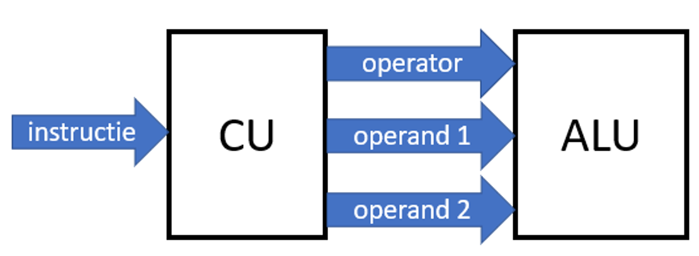
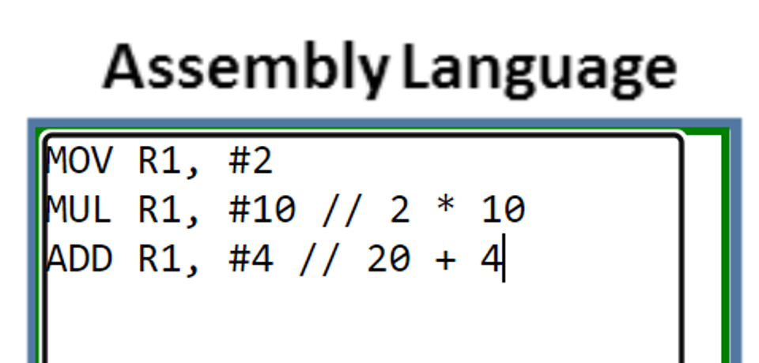
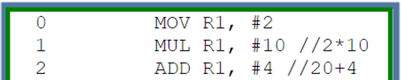
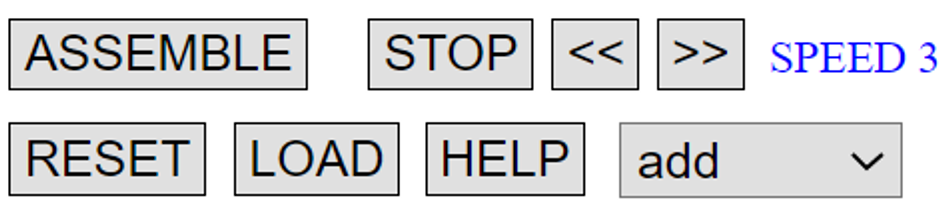
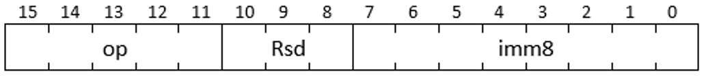
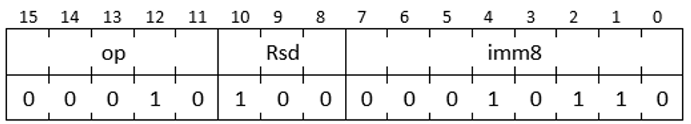
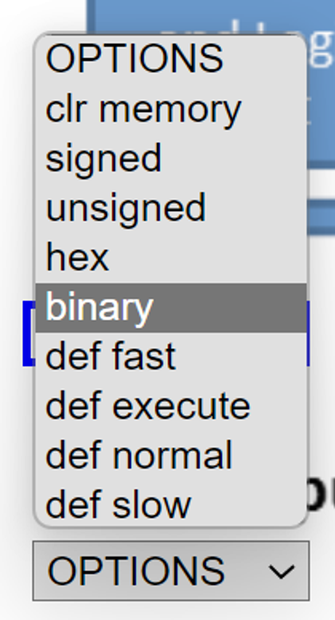
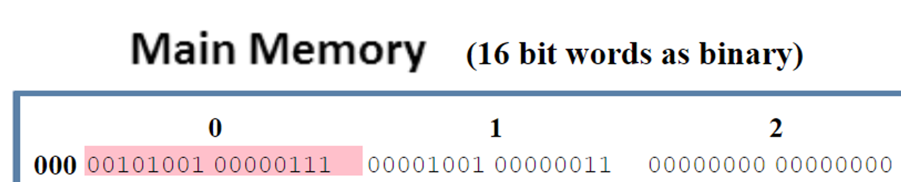
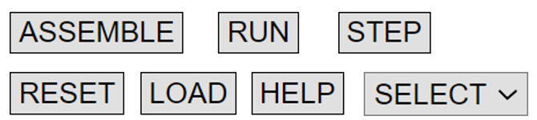
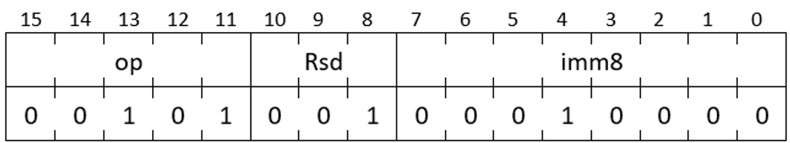

# Assembly en machinetaal

Q-highschool / Computerarchitectuur / Bijeenkomst 4

***

## Welkom!

Vandaag gaan we programmeren op het laagste niveau:
- Assembly schrijven
- Machinetaal begrijpen
- De RISC simulator gebruiken

Notes:

Duur: 2 minuten. Kort welkom en wat ze kunnen verwachten.

***

## Terugblik

Tot nu toe heb je geleerd:

- **Bijeenkomst 1:** Binair rekenen
- **Bijeenkomst 2:** Logische poorten en schakelingen  
- **Bijeenkomst 3:** Processorarchitectuur (von Neumann, Harvard)

Vandaag: hoe geef je instructies aan de processor?

Notes:

Duur: 3 minuten. Snelle terugblik om context te geven.

***

## De vraag van vandaag

Je hebt geleerd hoe een processor werkt met:
- Registers
- ALU (rekenunit)
- Control Unit (besturingseenheid)
- Geheugen

**Maar hoe zeg je tegen een processor wat hij moet doen?**

Notes:

Duur: 2 minuten. Maak ze nieuwsgierig.

***

## Assembly programmeren

**Assembly** is de meest directe manier om met een processor te communiceren

Je schrijft instructies zoals:
- `ADD R4, #22` → tel 22 op bij register 4
- `MOV R1, #10` → zet 10 in register 1
- `SUB R3, #5` → haal 5 af van register 3

Elke instructie doet precies één ding

Notes:

Duur: 5 minuten. Introduceer assembly als concept.

---

## Van code naar processor



De **Control Unit** ontvangt instructies en stuurt de **ALU** aan

Notes:

Leg uit: 
- CU = Control Unit = besturingseenheid
- ALU = Arithmetic Logic Unit = rekenunit
- Instructies gaan naar CU, die de ALU vertelt wat te doen

***

## De RISC simulator

Vandaag werken we met de [RISC simulator](https://peterhigginson.co.uk/RISC/)

Dit is een online simulator die laat zien hoe een processor instructies uitvoert

Je kunt er assembly code schrijven en stap voor stap zien wat er gebeurt

Notes:

Duur: 3 minuten. Laat kort de simulator zien op het scherm.

---

## RISC simulator interface



Links boven: hier schrijf je code

Notes:

Laat zien waar ze code kunnen typen.

---

## Code invoeren



Na het typen: klik op **Submit**

Je code krijgt regelnummers (geheugenadressen)

Notes:

De regelnummers zijn de adressen in het geheugen waar de instructies staan.

---

## Code uitvoeren



- **RUN**: voer het hele programma uit
- **STEP**: ga stap voor stap door je code
- **RESET**: begin opnieuw
- **<< / >>**: pas de snelheid aan

Notes:

STEP is handig om te begrijpen wat elke instructie doet.

***

## Basis instructies

De belangrijkste instructies die je vandaag gebruikt:

<div style="font-size: 0.8em">

| Instructie        | Betekenis                     |
| ----------------- | ----------------------------- |
| `MOV Rd, #getal`  | Zet een getal in een register |
| `ADD Rsd, #getal` | Tel een getal op              |
| `SUB Rsd, #getal` | Trek een getal af             |
| `MUL Rsd, #getal` | Vermenigvuldig                |
| `MOD Rsd, #getal` | Neem de rest (modulo)         |
| `HLT`             | Stop het programma            |
</div>
Notes:

Duur: 5 minuten.

Leg uit:
- Rd = destination register (waar het resultaat komt)
- Rsd = source + destination (gebruikt waarde EN slaat resultaat op)
- #getal = een directe waarde (maximaal 255)
- R0 t/m R7 zijn de beschikbare registers

---

## Voorbeeld: optelling

Bereken: 4 + 2 × 10

In assembly:

```asm
MOV R1, #2      // Zet 2 in R1
MUL R1, #10     // R1 = R1 * 10 = 20
ADD R1, #4      // R1 = R1 + 4 = 24
HLT             // Stop
```

Let op de volgorde: eerst vermenigvuldigen, dan optellen!

Notes:

Dit is een voorbeeld van hoe je een berekening ontleedt in stappen.

***

## Voordoen: eerste assembly programma
<!-- .slide: class="voordoen" -->

Laten we samen een programma schrijven:

Bereken: (16 + 12) % 3

Notes:

Duur: 10 minuten.

**Stap voor stap voordoen:**

1. Eerst 16 in een register zetten: `MOV R1, #16`
2. Dan 12 optellen: `ADD R1, #12` (nu is R1 = 28)
3. Dan modulo 3: `MOD R1, #3` (nu is R1 = 1)
4. Stoppen: `HLT`

Typ dit in de RISC simulator en voer uit met STEP om te laten zien wat er gebeurt.

Laat zien hoe de waarden in de registers veranderen.

***

## Stappenplan voor assembly

Bij elke som volg je deze stappen:

1. **Berekening ontleden** - welke operaties in welke volgorde?
2. **Register kiezen** - welk register gebruik je?
3. **Instructies opschrijven** - vertaal naar assembly
4. **Testen** - voer uit in de simulator

Notes:

Dit stappenplan helpt om systematisch te werken.

***

## Werkblok 1: Zelf aan de slag

**Opdracht** 

<div class="columns" style="grid-template-columns: 1.6fr 1fr; align-items: top, center;">
<div style="font-size: 0.6em">
Schrijf assembly code voor deze berekeningen:

1. 16 + 12 × 2
2. 2 × 3 × 5
3. 14 × 2 × 3 - 15
4. 49 - 25
5. 20 % 6

Test elke berekening in de RISC simulator!
</div>
<div style="font-size: 0.4em; border: 1px solid black; background-color: lightgray;">
Als je code niet werkt:

- Gebruik **STEP** om regel voor regel te gaan
- Kijk naar de registers: veranderen ze zoals je verwacht?
- Controleer je volgorde: staat alles in de juiste volgorde?
- Heb je **HLT** aan het einde?

</div>
Notes:

Duur: 30 minuten.

Loop rond en help waar nodig. Laat leerlingen STEP gebruiken om te debuggen.

Moedig aan om commentaar toe te voegen met // 

Antwoorden (voor jezelf):

1. `MOV R1, #12` / `MUL R1, #2` / `ADD R1, #16` / `HLT`
2. `MOV R1, #2` / `MUL R1, #3` / `MUL R1, #5` / `HLT`
3. `MOV R1, #14` / `MUL R1, #2` / `MUL R1, #3` / `SUB R1, #15` / `HLT`
4. `MOV R1, #49` / `SUB R1, #25` / `HLT`
5. `MOV R1, #20` / `MOD R1, #6` / `HLT`

---

## Van assembly naar machinetaal

Assembly code moet vertaald worden naar **machinetaal**

Machinetaal = binaire instructies die de processor begrijpt

Een **assembler** vertaalt assembly naar machinetaal

Vandaag ga je zelf machinetaal lezen en schrijven!

Notes:

Duur: 2 minuten. Introduceer het tweede deel van de les.

---

## Alles is enen en nullen

Een computer begrijpt alleen:
- 0 en 1

Dus ook instructies zijn reeksen van bits

Voorbeeld: `ADD R4, #22` wordt `0001010000010110`

Notes:

Dit is het moment om te benadrukken dat alles uiteindelijk binair is.

***

## Instructieformaat

In de RISC simulator is elke instructie 16 bits lang:



Elke instructie bestaat uit **velden**:
- **op** (5 bits): welke operatie?
- **Rsd** (3 bits): welk register?
- **imm8** (8 bits): welk getal?

Notes:

Duur: 5 minuten.

Leg uit dat een 'veld' een groepje bits is met een specifieke betekenis.

---

## Operation codes

De eerste 5 bits bepalen welke operatie:

<div style="font-size: 0.7em">

| Opcode  | Betekenis              |
| ------- | ---------------------- |
| `00000` | halt                   |
| `00001` | modulo                 |
| `00010` | optellen               |
| `00011` | aftrekken              |
| `00100` | vergelijken            |
| `00101` | waarde instellen (MOV) |
| `00110` | logische AND           |
| `00111` | logische OR            |

</div>
Notes:

De opcode vertelt de processor welke operatie uitgevoerd moet worden.

---

## Register veld

De volgende 3 bits geven het register aan:

<div style="font-size: 0.7em">

| Binair | Register |
| ------ | -------- |
| `000`  | R0       |
| `001`  | R1       |
| `010`  | R2       |
| `011`  | R3       |
| `100`  | R4       |
| `101`  | R5       |
| `110`  | R6       |
| `111`  | R7       |
</div>
Notes:

Met 3 bits kun je 8 registers aanduiden (0-7).

---

## Immediate value

De laatste 8 bits zijn het getal zelf

8 bits = getallen van 0 tot 255

Voorbeeld: 22 in binair = `00010110`

Notes:

Daarom kun je in deze instructies geen getallen groter dan 255 gebruiken.

***

## Voorbeeld: ADD R4, #22



- **opcode**: `00010` → ADD
- **Rsd**: `100` → R4  
- **imm8**: `00010110` → 22 in binair

Hele instructie: `0001010000010110`

Notes:

Duur: 5 minuten. Laat zien hoe je stap voor stap de instructie opbouwt.

***

## Machinetaal in de simulator

Je kunt ook direct machinetaal invoeren:



Klik onderaan bij OPTIONS op **binary**

Notes:

Duur: 3 minuten. Laat kort zien hoe dit werkt.

---

## Geheugen bewerken



Je kunt nu direct in het geheugen (Main Memory) binaire codes typen

Notes:

Let op: dit kan alleen als je NIET in de assembly editor zit. Klik eerst op Submit of Cancel.

---

## Fetch-Decode-Execute cyclus



Als je op RUN klikt, zie je:
- **Rood**: instructie ophalen (fetch)
- **Blauw**: operanden naar ALU sturen (execute)

Notes:

Dit laat de fetch-decode-execute cyclus in actie zien!

***

## MOV instructie



Om een waarde in een register te laden:

- **opcode**: `00101` (MOV)
- **Rd**: het doelregister
- **imm8**: de waarde

Voorbeeld: `MOV R1, #16` = `0010100100010000`

Notes:

MOV is vaak de eerste instructie in een programma om startwaarden in te stellen.

***

## Werkblok 2: Machinetaal decoderen

**Opdracht deel 1** - Wat betekent deze code?

<div style="font-size: 0.7em">

Gegeven registerwaarden:
- R1 = 16, R2 = 11, R3 = 20
- R4 = 7, R5 = 29, R6 = 49

Decodeer deze instructies:

1. `0001111000101010`
2. `0000101000000100`
3. `0001010000011000`

</div>
Notes:

Duur: 15 minuten voor deze opdrachten.

Antwoorden:
1. SUB R6, #42 → R6 = 49 - 42 = 7
2. MOD R2, #4 → R2 = 11 % 4 = 3
3. ADD R2, #24 → R2 = 11 + 24 = 35

---

## Werkblok 2: Machinetaal schrijven

**Opdracht deel 2** - Schrijf deze sommen in machinetaal:

<div style="font-size: 0.7em">

1. 7 % 3 (gebruik R1)
2. 11 + 14 (gebruik R2)
3. 49 - 25 (gebruik R3)

Elke som heeft 2 instructies nodig:
- Eerst `MOV` om waarde in register te zetten
- Dan de berekening

</div>
Notes:

Duur: 10 minuten voor deze opdrachten.

Antwoorden:

1. 7 % 3:
   - MOV R1, #7: `0010100100000111`
   - MOD R1, #3: `0000100100000011`

2. 11 + 14:
   - MOV R2, #11: `0010101000001011`
   - ADD R2, #14: `0001001000001110`

3. 49 - 25:
   - MOV R3, #49: `0010101100110001`
   - SUB R3, #25: `0001101100011001`

---

## Extra uitdaging

Als je klaar bent:

- Test je machinetaal in de simulator (zet OPTIONS op binary)
- Schrijf complexere berekeningen
- Probeer te voorspellen wat de processor doet bij elke stap

Notes:

Voor snelle leerlingen die extra uitdaging willen.

***

## Wat hebben we geleerd?

Vandaag heb je:

✓ Assembly code geschreven

✓ De RISC simulator gebruikt

✓ Berekeningen ontleed in instructies

✓ Machinetaal gelezen en geschreven

✓ Gezien hoe een processor instructies uitvoert

Notes:

Duur: 5 minuten voor afsluiting.

---

## Het grotere plaatje

**Assembly** → (assembler) → **Machinetaal** → Processor

Programmeurs schrijven meestal in talen zoals Python of Java

Die worden **gecompileerd** of **geïnterpreteerd** naar machinetaal

Maar nu begrijp je wat er onder de motorkap gebeurt!

Notes:

Maak de koppeling naar hogere programmeertalen die ze kennen.

***

## Huiswerk

**Uit de syllabus:**
- Hoofdstuk: Machinetaal - Instructies voor de processor
- Maak alle oefenopgaven over assembly
- Maak de opdrachten over machinetaal decoderen en schrijven

**Extra:**
- Experimenteer met de RISC simulator
- Probeer complexere berekeningen te programmeren

Notes:

Volgende keer: meer over geheugen en complexere programma's met loops en conditionals.

***

## Vragen?

Notes:

Complimenteer de leerlingen. Dit is pittige stof!
