# Logica voor computers

## En zo begint het

### Tekens & betekenis

Cijfers, letters, gebaren, signalen, afbeeldingen, pictogrammen, iconen. Deze gebruik je om een boodschap over te brengen of gegevens vast te leggen. Kortom: communicatie. Het is nodig om hierover afspraken te maken. De  betekenis van een afbeelding of een combinatie van een aantal tekens moet worden vastgelegd.  Zo’n afspraak noem je een code.

[co·de *(de; m;* meervoud: *codes)*

: **1** verzameling van overeengekomen woorden en tekens met een afgesproken betekenis

: **2** regels waaraan beoefenaars van allerlei beroepen zich vrijwillig onderwerpen: *beroepscode, gedragscode, reclamecode*

Zowel betekenis 1 als 2 gaan over een afspraak.

 *[www.vandale.nl](http://www.vandale.nl/) (27 juni 2022)*

### Syntax & semantiek

Voor het Nederlandse schrift worden 26 letters gebruikt in twee vormen: kleine letters en hoofdletters. Verder zijn er een aantal interpunctietekens. De ontelbare combinaties hiervan worden gemaakt met behulp van syntaxregels. Je hebt bij de vakken waar je een taal leert (dus ook Nederlands) hier al uitgebreid mee te maken gehad. Syntax of in normaal Nederlands *zinsbouw* is een onderdeel van de *grammatica* van een taal. Met de syntax kun je beschrijven welke zinnen wel en welke zinnen geen onderdeel van een taal vormen. 

Wanneer je het over de *semantiek* van een taal hebt, dan gaat het over de betekenis van een zin. Wat wordt er bedoeld met een zin. Met een mensentaal komt het regelmatig voor dat een syntactisch correcte zin meerdere betekenissen heeft. Kijk maar even naar de volgende zin:

> De man slaat de hond met de stok

De zin is grammaticaal helemaal correct, maar we kunnen nu niet met zekerheid zeggen of het nu de man een hond slaat, die een stok een zijn bek heeft *óf* dat de man gebruikt maakt van een stok om een hond te slaan. Hoe dan ook, het is een best zielig voorbeeld en het laat wel goed zien dat de betekenis van een correcte gevormde zin niet altijd duidelijk is.

Een computer is over het algemeen erg goed in het bepalen of iets syntactisch correct is. Je herkent het vast wel van de meldingen, die je van Python of een andere programmeertaal krijgt: `Syntax error: ...`. Dan ben je vast ergens iets als een haakje vergeten. De 'betekenis' van een programma kun je meestal alleen achterhalen door het programma uit te voeren (al dan niet in je hoofd). Dit maakt het vinden van niet-syntactische fouten in je programma ook zo moeilijk.

Om ervoor te zorgen dat een computer met tekens kan werken, zullen we hier dus afspraken over moeten maken. *Welke tekens en wat betekenen ze*.

### Geschiedenis 

Bij moderne computers wordt elektriciteit gebruikt. Hoe simpel zou je de daarin gebruikte code kunnen maken? Als volgt: er is géén of wél stroom (eventueel spanning) aanwezig, waarbij we ‘geen’ aangeven met ‘0’ en ‘wel’ met ‘1’. Een code van twee mogelijkheden, de binaire code. Dit basiselement van de code wordt ‘bit’ genoemd. Een serie van 8 bits (een byte, by-eight) zorgt voor 256 verschillende combinaties. Je hebt hier in hoofdstuk {doc}`binair_rekenen` al mee leren rekenen. Nu de betekenis nog! De afspraken over de betekenis ervan moeten worden vastgelegd. Zo kun je met een binaire code rekenen, maar je kunt ook de computer via een instructie laten weten: nu volgt er een code, waarvan de betekenis is vastgelegd is in de ASCII-tabel.

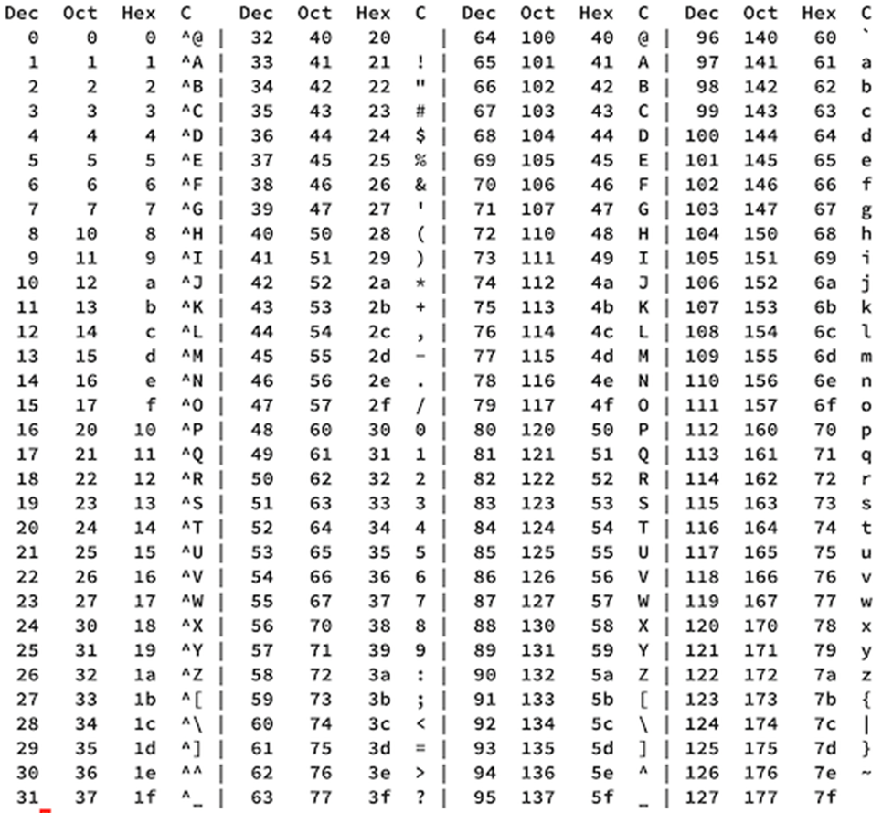

::: {exercise}

Schrijf met behulp van de bovenstaande ASCII-tabel de binaire tekenreeks van je voornaam. Tip: ga via de hexadecimale notatie naar binair.

Wat is de beperking van de ASCII-tabel?

Wat is de opvolger van ASCII?

Uit hoeveel bits bestaat een teken van deze code?

:::

## Inleiding logische schakelingen

In de processor van een computer wordt door de ALU, de Arithmetic Logic Unit (rekenkundig-logische eenheid, rekencentrum) rekenkundige en logische bewerkingen uitgevoerd. Dit is een complex proces van elektronica op microniveau. Wat ooit begon met onderdelen zoals forse schakelaars, relais, elektronenbuizen en transistors is nu zo geminiaturiseerd, dat een moderne processor miljarden schakelingen bevat op een oppervlakte niet veel groter dan je duimnagel. Dit in tegenstelling tot de eerste computers, gemaakt met elektronenbuizen. Deze coomputers waren zo groot dat je een flinke zaal nodig had om ze te kunnen 'hebben'. En daar bleef het niet bij: ze vraten zoveel stroom en genereerde zoveel warmte dat ze een aparte airconditioning nodig hadden. Door deze schakelingen loopt een elektronenstroom. Door de miniaturisatie zijn de afstanden die de elektronen af moeten leggen kleiner geworden.  Een kleinere afstand betekent sneller. Een duizend keer kleinere afstand wordt immers duizend keer vlugger afgelegd. Of het nu een primitieve kamerbrede computer is met airconditioning of een hypermoderne processor ter grootte van je duimnagel, het principe van de schakelingen, waar stroom doorheen gaat blijft hetzelfde.

Slimme constructies van schakelingen maken het mogelijke dat een computer kan rekenen. Aan de invoerkant van zo’n constructie wordt een binair signaal aangeboden en aan de uitvoerkant komt het resultaat, ook weer een binair signaal.

Een andere toepassing is die van opslag. Het is vaak noodzakelijk dat resultaten (of tussenresultaten) in het werkgeheugen van een computer worden opgeslagen om later weer te worden gebruikt.

Om resultaten (uitvoer) verder te verwerken is het nodig dat de signalen, die deze resultaten bevatten, niet alleen kunnen worden opgeslagen, maar als het nodig is ook naar de juiste plek kunnen worden gestuurd. Dit doorsturen wordt mogelijk gemaakt met, je raadt het al, schakelingen.

Verderop in dit hoofdstuk ga je zelf aan de slag met het ‘bouwen’ van constructies voor rekenen, opslag en doorschakelen (doorsturen).

### Waarom logische schakelingen?

Waarom zou je logische schakelingen gebruiken in een computer? Logische schakelingen kun je sturen met elektrische signalen. Ze zijn handig, omdat ze maar twee verschillende uitvoermogelijkheden hebben, die je kunt uitleggen als één en nul of waar en niet waar. Hetzelfde geldt voor de invoersignalen van deze schakelingen. De schakelingen worden daarmee bouwstenen waarmee je kunt ‘sturen’.

Dus, als je aan het open of dicht zijn van schakelaars een betekenis geeft, heb je de basis gelegd voor het werken met code. Dicht of open, wel of geen stroom, wel of geen signaal, waar of niet waar, één of nul. De bit, als basiseenheid voor de code.

Altijd énen of nullen? Dat is nog maar de vraag. De computers van nu werken hier wel mee. De Von Neuman-architectuur hangt hiermee samen. Deze wordt in een volgend hoofdstuk behandeld. Er zijn in het verleden ook experimentele computers geweest, die met een driewaardige logica werkten. Dit was slechts een academische oefening, [ternaire computers](https://en.wikipedia.org/wiki/Ternary_computer) zijn nooit uit het laboratorium gekomen. Een ontwikkeling, die mogelijk in de toekomst bruikbaar wordt en ongekende mogelijkheden beloofd, is, die van de quantumcomputer.

Lees hiervoor meer op https://www.universiteitleiden.nl/wetenschapsdossiers/de-quantumcomputer

::: {exercise}

Wat is booleaanse logica?

Maakt de quantumcomputer gebruik van bits? Leg uit!

Wat is de belofte die de quantumcomputer hoopt waar te maken?

Wat zou je, behalve stroom, nog meer kunnen gebruiken om 1-en en 0-en fysiek te representeren?

:::

Slimme constructies van schakelingen maken het mogelijke dat een computer kan rekenen. Aan de invoerkant van zo’n constructie wordt een binair signaal aangeboden en aan de uitvoerkant komt het resultaat.

Een andere toepassing is die van opslag. Het is vaak noodzakelijk dat resultaten (of tussenresultaten) in het werkgeheugen van een computer worden opgeslagen om later weer te worden gebruikt.

Om resultaten (uitvoer) verder te verwerken is het nodig dat de signalen, die deze resultaten bevatten, niet alleen kunnen worden opgeslagen, maar als het nodig is ook naar de juiste plek kunnen worden gestuurd. Dit doorsturen wordt mogelijk gemaakt met, je raadt het al, schakelingen.

Verderop in dit hoofdstuk ga je zelf aan de slag met het ‘bouwen’ van constructies voor rekenen, opslag en doorschakelen (doorsturen).

### Hoe kun je stroom laten schakelen?

Dit kan door bijvoorbeeld een relais of een electronenbuis te gebruiken. Een relais zou je kunnen zien als een met stroom bestuurbare lichtschakelaar. Een relais maakt ook geluid, wanneer hij schakelt. Je kent het klikje wel in sommige geluidsversterkers. Meestal is dat een relais, die in een _aan_-stand gaat. Het nadeel aan een relais is dat er echt iets beweegt in de relais, wanneer hij schakelt. Dit zorgt voor vertraging en warmte. Dus een computer bouwen met relais is mogelijk, maar niet verstandig. Een andere mogelijkheid is het gebruiken van een electronenbuis. Die werken 'logisch' gezien hetzelfde. Daar zitten geen bewegende onderdelen in. Nadeel aan een electronenbuis is dat deze erg gevoelig zijn voor storingen en ze een grote hoeveelheid energie vreten. De eerste generaties computers (waaronder [Colossus](https://nl.wikipedia.org/wiki/Colossus_(computer)), [EDVAC](https://en.wikipedia.org/wiki/EDVAC), [Manchester SSEM](https://nl.wikipedia.org/wiki/Small-Scale_Experimental_Machine) en nog vele meer) werden gebouwd met behulp van electronenbuizen. Hoe komt het dat we nu meer rekenkracht in onze horloge hebben zitten, dan alle computers op de wereld in 1950 bij elkaar? De sleuteluitvinding hierbij is de _transistor_. Het is een klein onderdeel, wat weinig stroom verbruikt en dezelfde schakelfunctionaliteit als een relais of electronenbuis heeft. De eerste computer, die met transistoren gebouwd is, is de [TRADIC](https://en.wikipedia.org/wiki/TRADIC) uit 1954. Je hebt nog steeds heel veel transistoren nodig om een minimale computer te kunnen bouwen. De uitvindingen van het _integrated circuit (IC)_. Hiermee worden meerdere transistoren tegelijk op een component 'gebakken'. De chips in jouw telefoon en laptop zijn afstammelingen van deze eerste _integrated circuits_. Even ter vergelijking: de eerste microprocessor, de Intel 4004 (uit 1971) bevatte 2300 transistoren op een oppervlakte van 9 $mm^2$. De M1 processor van Apple (uit 2020) bevat 16 miljard transistoren op 119 $mm^2$. Met de transistordichtheid van de Intel 4004, zou een M1 een oppervlakte van ongeveer 62,7$m^2$ (!) moeten hebben. Dat is een groter oppervlakte dan een gemiddeld klaslokaal. En dat alleen voor de processor. Dan moet daar de rest van de computer nog bij.

Met enkele transistors kun je een logische poort maken. Een logische poort geeft afhankelijk van wat er aan signalen binnenkomt een uitgaand signaal. In de volgende paragraaf ga je kennis maken met een aantal van deze poorten. Deze poorten noemen we ook wel _logische schakelingen_.

### Logische schakelingen

Het rekencentrum van een computer is, zoals hiervoor verteld, opgebouwd uit logische schakelingen, schakelingen die bestaan uit grote hoeveelheden logische poorten die met elkaar zijn verbonden. Het werken met logische schakelingen laat het effect zien van een aantal belangrijke regels binnen de logica. Hiervoor ga je schakelingen maken die bestaan uit invoer van 0 of 1 (hiervoor kunnen ook schakelaars worden gebruikt), poorten en uitvoer naar leds (lampjes) of naar 0 of 1.

De schakelingen die je maakt vertonen een bepaald gedrag. Met het gedrag van een schakeling wordt bedoeld wat de relatie is tussen de invoer (stand van de schakelaars) en het effect op de uitvoer (wel of niet branden van de led/leds). Het volledige gedrag van een schakeling wordt beschreven door systematisch alle mogelijke combinaties van invoer op te sommen, waarbij van iedere mogelijkheid is aangegeven wat de uitvoer (0, 1 of het wel of niet branden van een led/lampje ) is.

In deze paragraaf komt verder aan bod hoe de logische poorten zich gedragen, wat het gedrag is van een schakeling waarin meerdere poorten met elkaar zijn verbonden en op welke manier een schakeling kan worden gebouwd die een bepaald gedrag moet vertonen.

---

Voor het bouwen van logische schakelingen zijn er verschillende tools beschikbaar. Voor deze module gebruiken we [Logicly](https://logic.ly/demo/), een gratis online programma. We maken in deze module gebruik van de Amerikaanse notatie van poorten.

### Poorten

In dit hoofdstuk worden schakelingen gemaakt met de poorten AND, OR, XOR en NOT. In het Nederlands heten deze EN, OF, XOF en NIET. De Nederlandse namen worden in dit hoofdstuk verder niet gebruikt.

#### AND-poorten

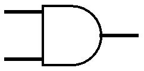

Een AND-poort heeft twee ingangen en één uitgang. Een AND-poort stuurt alleen een signaal naar de uitgang als er door beide ingangen een signaal binnenkomt.

:::{exercise}

Bouw in [Logicly](https://logic.ly/demo/) een schakeling met een AND-poort. Deze heeft of krijgt 2 ingangen voor invoersignalen en 1 uitgang voor het resultaat. Sluit schakelaars aan op de ingangen en sluit de uitgang aan op de ingang van een lamp.  In totaal heb je 3 verbindingsdraden nodig. Laat de schakeling werken door de schakelaars om te zetten. Controleer of de lamp inderdaad alleen brandt als beide invoersignalen de waarde 1 hebben.

:::

**Waarheidstabel**

In een tabel kun je aangeven welke invoersignalen en resultaten bij elkaar horen. Zo’n tabel noemen we een ‘waarheidstabel’. Verderop in het hoofdstuk gaan we met zulke tabellen aan de slag.

#### OR-poort

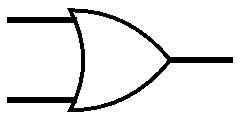

Een OR-poort heeft, net als een AND-poort, twee ingangen en één uitgang. Een OR-poort stuurt een signaal naar de uitgang als er door ten minste één van beide ingangen een signaal binnenkomt.

:::{exercise}

Bouw in [Logicly](https://logic.ly/demo/) een schakeling met een OR-poort. Deze heeft of krijgt 2 ingangen voor invoersignalen en 1 uitgang voor het resultaat. Sluit schakelaars aan op de ingangen en sluit de uitgang aan op de ingang van een lamp.  In totaal heb je 3 verbindingsdraden nodig. Laat de schakeling werken door de schakelaars om te zetten. Controleer of de lamp inderdaad alleen brandt als één van beide invoersignalen de waarde 1 heeft.

:::

#### XOR-poort

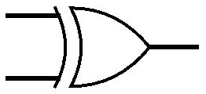

Een XOR poort heeft eveneens twee ingangen en één uitgang. Een XOR-poort stuurt een signaal naar de uitgang als er door exact één van beide ingangen een signaal binnenkomt.

:::{exercise}

Bouw in [Logicly](https://logic.ly/demo/) een schakeling met een XOR-poort. Deze heeft of krijgt 2 ingangen voor invoersignalen en 1 uitgang voor het resultaat. Sluit schakelaars aan op de ingangen en sluit de uitgang aan op de ingang van een lamp.  In totaal heb je 3 verbindingsdraden nodig. Laat de schakeling werken door de schakelaars om te zetten. Controleer of de lamp inderdaad alleen brandt als slechts één van beide invoersignalen de waarde 1 heeft (als het goed is gaat de lamp niet branden als beide invoersignalen de waarde 1 hebben).

:::

#### NOT-poort

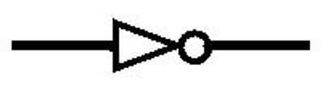

Een NOT-poort heeft slechts één ingang en één uitgang. Een NOT-poort stuurt een signaal naar de uitgang als er door de ingang geen signaal binnenkomt. Als er wel een signaal binnenkomt door de ingang, zal een NOT-poort geen signaal naar de uitgang sturen. Een NOT-poort keert het binnenkomende signaal als het ware om; een NOT-poort wordt daarom ook vaak een 'inverter' genoemd.

:::{exercise}

Bouw een schakeling met een NOT-poort. Sluit een schakelaar of invoer-Pin aan op de ingang van de NOT-poort en sluit de uitgang van de NOT-poort aan op de ingang van de led. In totaal heb je 2 verbindingsdraden. Laat de schakeling werken door de simulatie op te starten. Controleer of de lamp inderdaad alleen brandt als het invoersignaal waarde 0 heeft en controleer of de lamp uitgaat wanneer het invoersignaal de waarde 1 krijgt.

:::

#### Overige poorten

Er zijn naast de vier poorten die hiervoor zijn genoemd nog een aantal andere poorten die je ook vaak tegenkomt. Voorbeelden hiervan zijn een NAND-poort en een NOR-poort. Deze poorten zijn in feite een samenstelling van een AND-poort met een NOT-poort (NAND) en een samenstelling van een OR-poort met een NOT-poort (NOR). In het stuk over 'Samengestelde schakelingen' wordt dit verder besproken. 

### Samengestelde poorten

In het eerste gedeelte zijn enkelvoudige logische poorten besproken. De meeste schakelingen bestaan echter uit meerdere logische poorten die op elkaar zijn aangesloten. In een eerdere paragraaf (***Overige poorten***) is hier al kort iets over aangegeven.

Let op: Het sturen van een signaal (in het vervolg ‘S’) is gelijkwaardig aan ‘1’ of ‘schakelaar aan’. Het niet sturen van een signaal is gelijkwaardig aan ‘0’ of ‘schakelaar’ uit. De uitvoer, het resultaat (in het vervolg ‘R’) kan 0 of 1 zijn.

In deze paragraaf wordt gewerkt met waarheidstabellen. Als je wilt oefenen met de mogelijke combinaties van ingangen/schakelaars en met waarheidstabellen kun je eerste het gedeelte ‘[Oefenen met waarheidstabellen](oefenen_waarheidstabellen)’ bestuderen. Daarna ga je met dit gedeelte verder.
#### NAND-poort

De NAND-poort doet het tegenovergestelde van een AND-poort. De afbeelding hieronder toont op welke manier deze schakeling gemaakt kan worden met behulp van een AND- en een NOT-poort. Alleen als beide ingangen een signaal ontvangen (of de schakelaars aan staan, 1) zal de AND-poort als resultaat een signaal (1) afgeven. Dit signaal wordt vervolgens door de NOT-poort tegengehouden, waardoor er geen signaal meer op de uitgang van de NOT-poort staat (0). Als daar een led op is aangesloten, zal deze niet branden. Wanneer één of beide ingangen geen signaal doorgeven, dus beide 0 zijn, wordt er geen signaal afgegeven door de AND-poort. De NOT-poort krijgt dan geen signaal binnen (0) en zal in dat geval wel als resultaat een signaal (1) afgeven. Een aangesloten led gaat zal branden.

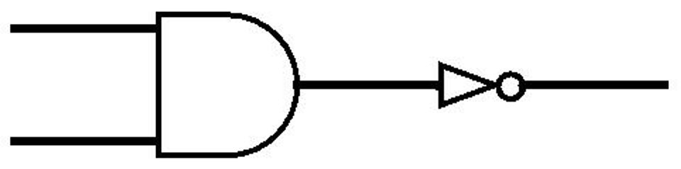

:::{exercise}

1. Maak zelf een NAND-poort met behulp van een AND- en een NOT-poort. Controleer of het uitvoersignaal 1 is, tenzij beide invoersignalen 1 zijn.

2. Maak zelf een NOR-poort met behulp van een OR- en een NOT-poort. Controleer of het uitvoersignaal alleen dan 1 is, wanneer beide invoersignalen 0 zijn.

3. Maak zelf een XNOR-poort met behulp van een XOR- en een NOT-poort. Controleer of het resultaat alleen dan 1 is, wanneer één invoer 0 en één invoer 1 is.

4. Beschrijf het gedrag van een NAND poort in een waarheidstabel, zoals hieronder aangegeven.

   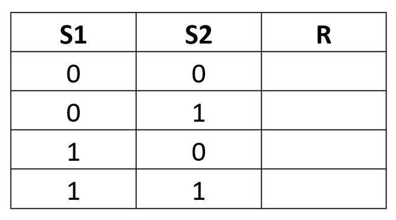

5. Beschrijf het gedrag van een NOR poort in een waarheidstabel.

6. Beschrijf het gedrag van een XNOR poort in een waarheidstabel.

7. Beschrijf het gedrag van onderstaande schakeling in een waarheidstabel.

   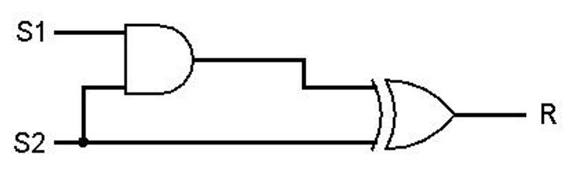

:::

Bestudeer onderstaande schakeling.

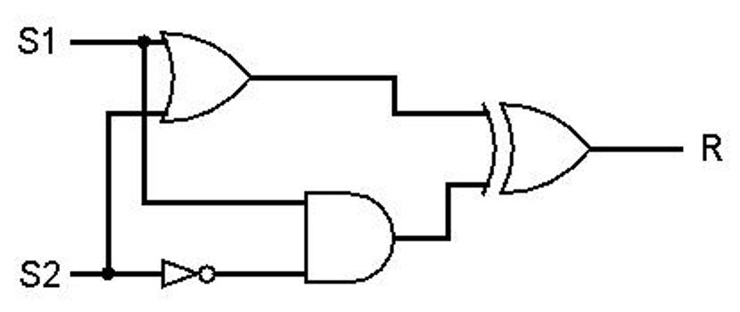

Om het gedrag van deze schakeling te bepalen kun je hem namaken. Als je de vier verschillende mogelijkheden dan uitprobeert weet je exact hoe deze schakeling zich gedraagt.

Het is ook mogelijk om het gedrag van deze schakeling te bepalen zonder de schakeling eerst na te hoeven maken. Dit kun je doen door een waarheidstabel te maken, met daarin voor iedere poort een eigen kolom. Je doet er verstandig als je de volgorde waarin de poorten in de waarheidstabel zijn opgenomen laat overeenkomen met de richting waarin de signalen lopen vanaf de invoer naar de uitvoer (in grote lijnen van links naar rechts).

In dit geval zou de waarheidstabel er als volgt uit kunnen zien:

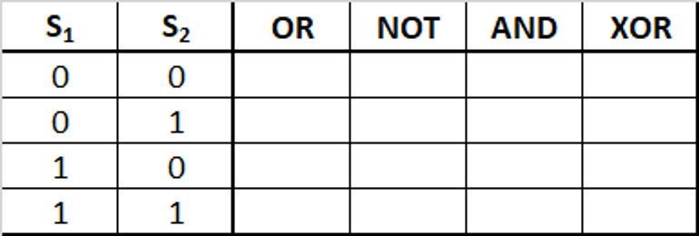

De OR-poort zal een signaal afgeven als ten minste één invoersignaal 1 is ). De NOT-poort zal een signaal afgeven als de onderste invoer (S2) 0 is. De kolom van de OR-poort en de kolom van de-NOT poort zijn dus redelijk eenvoudig in te vullen:

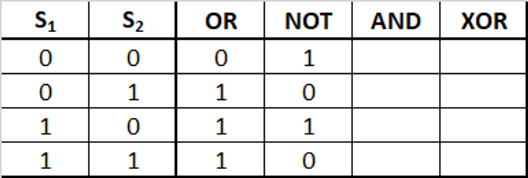

De AND-poort lijkt misschien iets lastiger. Deze poort krijgt als inkomende signalen een signaal van S1 en een signaal van de NOT-poort. Er moet dus voor de AND-poort voor iedere regel worden gekeken naar wat staat er in de eerste kolom (S1) en in de vierde kolom (NOT). Alleen als er op deze regel in beide kolommen een 1 staat, zal de AND-poort een signaal afgeven (in dat geval komt er bij de AND-poort een 1 te staan).

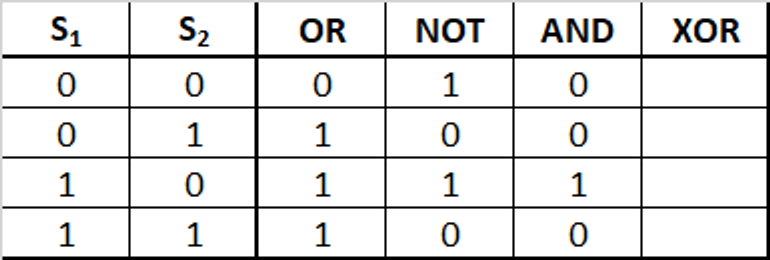

In de laatste kolom wordt genoteerd wanneer de XOR-poort een signaal doorgeeft. Hiervoor moet er worden gekeken naar wat er uit de OR-poort en uit de AND-poort komt. Er moet in de XOR-kolom een 1 komen te staan op de regels waarbij er in de OR- en AND-kolom exact één keer een 1 staat; op de overige regels in de XOR-kolom komt een 0.

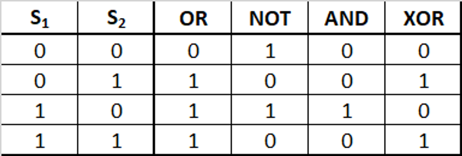

Het gedrag van de totale schakeling wordt weergegeven in de laatste kolom; het uitvoersignaal van de schakeling is enkel 1, wanneer de XOR-poort een signaal doorgeeft.

:::{exercise}

Neem de eerder gemaakte waarheidstabel van deze schakeling en gebruik nu een eigen kolom voor beide poorten. 

:::

### Optellen

We hebben het gehad over logische schakelingen en dat een processor opgebouwd is uit logische schakelingen. Één van de vele taken, die een processor moet uitvoeren is het optellen van binaire getallen. Hoe je dit met pen en papier doet, heb je geleerd in {doc}`binair_rekenen`. In deze paragraaf ga je leren hoe je de binaire optelling in logische schakelingen op kan bouwen.

#### Half-adder

Een adder is een schakeling waarmee je binaire getallen (bits) kunt optellen. In de processor van een computer worden hiermee berekeningen gedaan in de Arithmetic Logic Unit (ALU), ook wel rekenkundig-logische-eenheid (RLE) genoemd. Een eenvoudige vorm is een half adder. Deze heeft twee ingangen en geeft als resultaat twee uitgangssignalen.

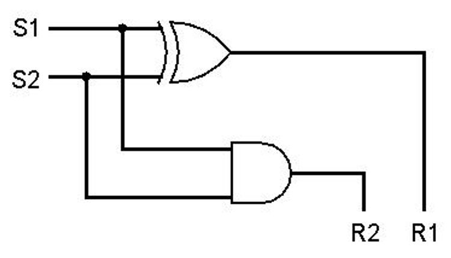

:::{exercise}

Waarom zijn er twee uitgangs-signalen?

:::

Bij de ingangen, S1 en S2, worden de twee op te tellen bits aangeboden. Het resultaat van deze optelling verschijnt bij R1 en bij R2. In binaire notatie is R1 de waarde rechts en R2 de waarde links van de binaire som.

:::{exercise}

1. Bouw de half adder in [Logicly](https://logic.ly/demo/) en ga hiermee de vier mogelijke optellingen na. Noteer dit in een waarheidstabel.
2. Waarom is de uitkomst 1 voor R1 en tegelijk 1 voor R2 niet mogelijk met deze schakeling?
3. Hoe zou dit opgelost kunnen worden?

:::

De invoerbits worden A en B genoemd. De ‘rechterwaarde (R1)’ is de som S. De ‘linkerwaarde (R2)’ kan overgedragen worden aan een volgende optelling en heet daarom *Co* (Carry-out). Dit is wat je bij met pen en papier optellen hebt geleerd als '1 onthouden'. Hieronder de schakeling met de juiste letters erbij:

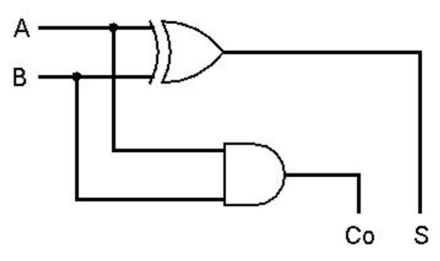

#### Full-adder

Bij een full adder wordt rekening gehouden met een eventuele Carry-out (Co) van een vorige optelling. De Carry-out van deze vorige optelling wordt gekoppeld aan de Carry-in van de volgende. Wanneer je een 4 bits full-adder wil maken, hoef je alleen maar 4x een 1-bits full adder op handige wijze aan elkaar te koppelen.

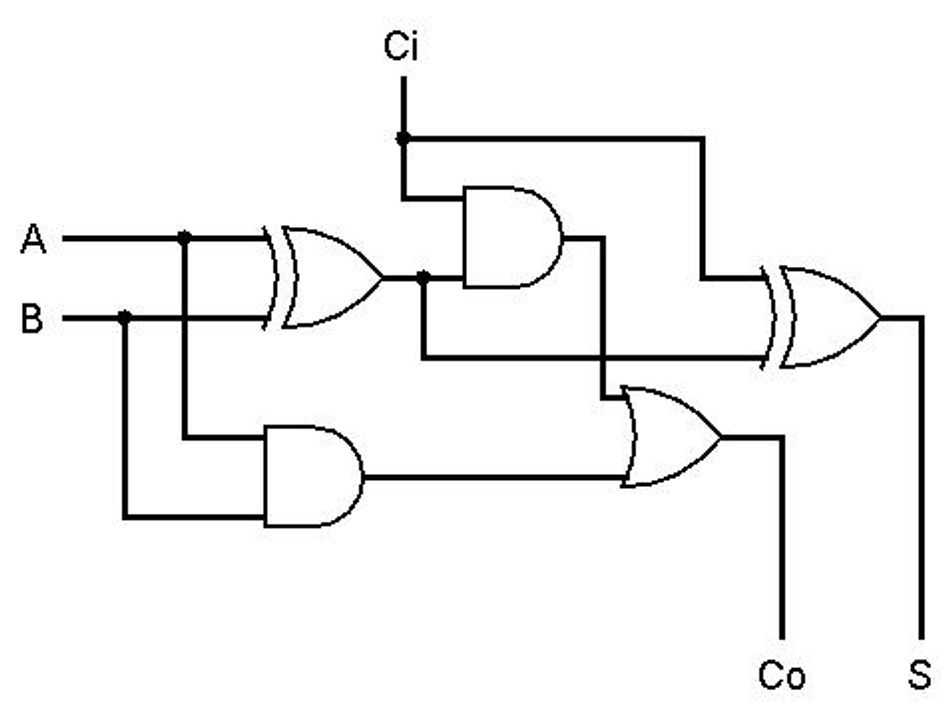

:::{exercise}

Bouw een 1 bits full adder in [Logicly](https://logic.ly/demo/) en ga hiermee de acht mogelijke optellingen na. Noteer dit in een waarheidstabel.

:::

(oefenen_waarheidstabellen)=

### Oefenen met waarheidstabellen

Bij het gedrag van een schakeling wordt gekeken naar de relatie tussen invoer- en uitvoersignalen, naar het effect van de aangeboden signalen op de uitvoer. Afhankelijk van de gebruikte modelleeromgeving kun je hierbij schakelaars en leds of in- en uitvoerpins gebruiken. Wanneer brandt een led wel en wanneer niet? Of anders gezegd: wanneer is de uitvoer ‘1’ en wanneer is deze ‘0’?

Het volledige gedrag van een schakeling wordt beschreven door van elke mogelijke combinatie van invoersignalen (of standen van de schakelaars) het uitvoersignaal te geven. Voor het beschrijven wordt gebruik gemaakt van zogenaamde waarheidstabellen, waarbij op iedere regel zowel de invoersignalen als het bijbehorende uitvoersignaal of, als er meerdere uitgangen zijn, de bijbehorende uitvoersignalen worden vermeld. Er zijn dus net zoveel regels in de tabel als er combinaties zijn.

Wanneer een schakeling maar één invoer heeft en één uitvoer, dan zijn er niet meer dan twee mogelijkheden. Als er geen signaal (0) aangeboden wordt is er geen signaal bij de uitvoer. Als er wél een signaal (1) aangeboden wordt, is er ook een signaal bij de uitvoer.

In een waarheidstabel:

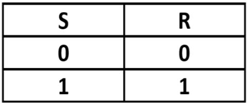

Wanneer een schakeling twee ingangen heeft (S1 en S2), dan beschrijft het gedrag  vier mogelijkheden. Het invoersignaal op S2 kan zowel 0 als 1 zijn. Ook op S1 zijn er twee mogelijkheden voor invoersignalen: 0 of 1. Dit geeft in totaal 2 x 2 combinaties, die opgenomen zijn in deze waarheidstabel.

Bij drie ingangen zijn er in totaal acht combinaties mogelijk. Zoals we hiervoor hebben gezien zijn er bij twee ingangen (neem S2 en S3) vier verschillende combinaties. Deze vier combinaties zijn er bij elk van beide mogelijke ingangssignalen (0 of 1) voor S1. Dit geeft in totaal dus 2 x 4 = 8 combinaties.

Bij vier ingangen zijn er 16 mogelijke combinaties: de 8 combinaties van drie ingangen als het invoersignaal op  vierde ingang 0 is én de 8 combinaties van deze drie ingangen als het invoersignaal op de vierde ingang 1 is. Totaal zijn dat 16 mogelijkheden. 

:::{exercise}

In onderstaande tabel moeten alle mogelijkheden worden beschreven die er zijn met vier ingangen. Vul deze tabel verder in.

:::

## Verdiepingsopdrachten en een game

1. Hoe ver kom jij in de NAND Game? Maak een document aan met screenshots van de levels, die je opgelost hebt.

2. Beschrijf, met behulp van een waarheidstabel, het gedrag van onderstaande schakeling. Met welke poort komt dit gedrag overeen?
   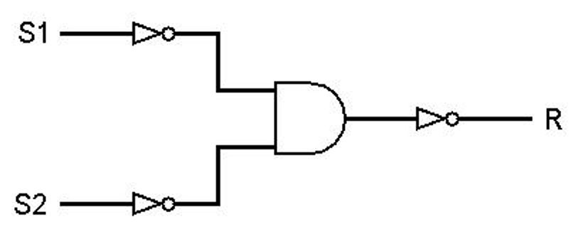
3. Beschrijf het gedrag van onderstaande schakeling. Waar komt dit gedrag mee overeen?
   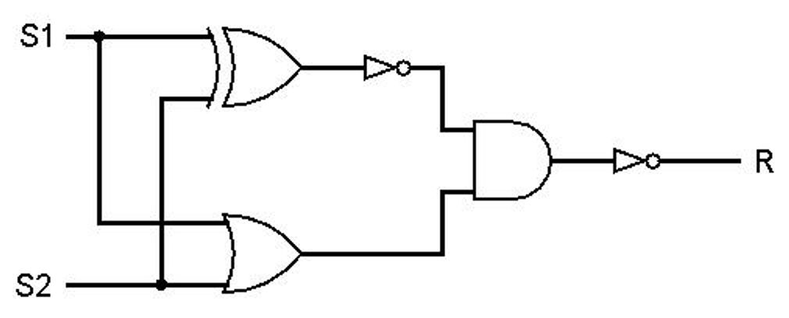

Bij grotere samengestelde schakelingen is het raadzaam om alle logische poorten te nummeren en in de kopregel van de waarheidstabel de nummers te noteren van de betreffende poorten.

Voorbeeld:

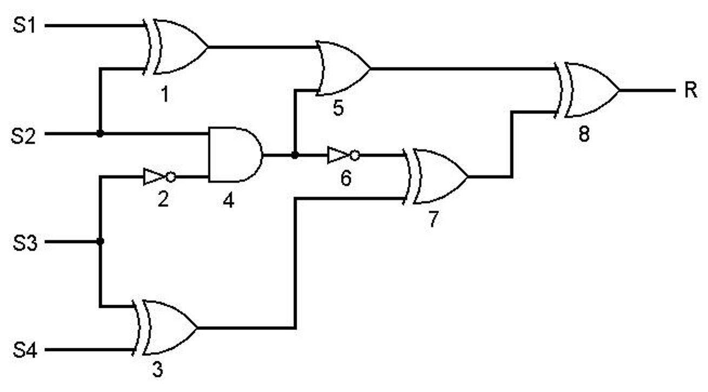

In bovenstaande schakeling zijn de poorten genummerd. Bij de nummering van de poorten is gewerkt vanaf de invoer naar de uitvoer (in grote lijnen van links naar rechts, van boven naar beneden). Voor iedere poort (met het nummer) is een kolom opgenomen in de waarheidstabel. Het gedrag kan je nu bepalen door de kolommen van links naar rechts in te vullen. Je komt dan uit op onderstaande waarheidstabel.

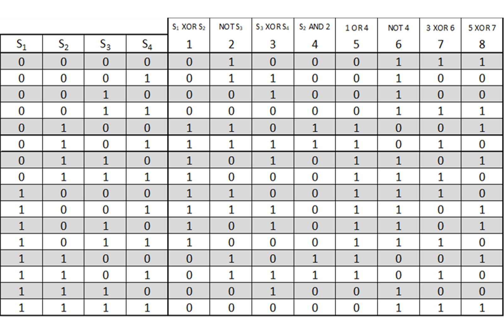

Het gedrag van de schakeling kan nu worden afgelezen uit de meest rechter kolom.

4. Bepaal het gedrag van onderstaande schakeling:
   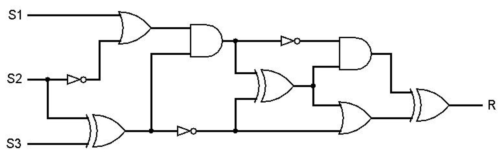
