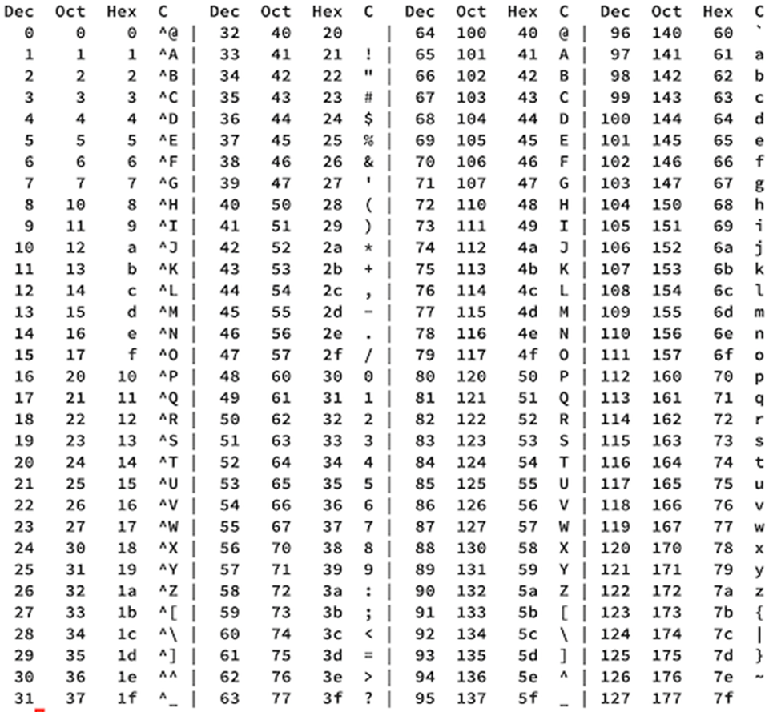

# Logica voor computers

## En zo begint het

### Tekens & betekenis

Cijfers, letters, gebaren, signalen, afbeeldingen, pictogrammen, iconen. Deze gebruik je om een boodschap over te brengen of gegevens vast te leggen. Kortom: communicatie. Het is nodig om hierover afspraken te maken. De  betekenis van een afbeelding of een combinatie van een aantal tekens moet worden vastgelegd.  Zo’n afspraak noem je een code.

[co·de *(de; m;* meervoud: *codes)*

: **1** verzameling van overeengekomen woorden en tekens met een afgesproken betekenis

: **2** regels waaraan beoefenaars van allerlei beroepen zich vrijwillig onderwerpen: *beroepscode, gedragscode, reclamecode*

Zowel betekenis 1 als 2 gaan over een afspraak.

 *[www.vandale.nl](http://www.vandale.nl/) (27 juni 2022)*

### Syntax & semantiek

Voor het Nederlandse schrift worden 26 letters gebruikt in twee vormen: kleine letters en hoofdletters. Verder zijn er een aantal interpunctietekens. De ontelbare combinaties hiervan worden gemaakt met behulp van syntaxregels. Je hebt bij de vakken waar je een taal leert (dus ook Nederlands) hier al uitgebreid mee te maken gehad. Syntax of in normaal Nederlands *zinsbouw* is een onderdeel van de *grammatica* van een taal. Met de syntax kun je beschrijven welke zinnen wel en welke zinnen geen onderdeel van een taal vormen. 

Wanneer je het over de *semantiek* van een taal hebt, dan gaat het over de betekenis van een zin. Wat wordt er bedoeld met een zin. Met een mensentaal komt het regelmatig voor dat een syntactisch correcte zin meerdere betekenissen heeft. Kijk maar even naar de volgende zin:

> De man slaat de hond met de stok

De zin is grammaticaal helemaal correct, maar we kunnen nu niet met zekerheid zeggen of het nu de man een hond slaat, die een stok een zijn bek heeft *óf* dat de man gebruikt maakt van een stok om een hond te slaan. Hoe dan ook, het is een best zielig voorbeeld en het laat wel goed zien dat de betekenis van een correcte gevormde zin niet altijd duidelijk is.

Een computer is over het algemeen erg goed in het bepalen of iets syntactisch correct is. Je herkent het vast wel van de meldingen, die je van Python of een andere programmeertaal krijgt: `Syntax error: ...`. Dan ben je vast ergens iets als een haakje vergeten. De 'betekenis' van een programma kun je meestal alleen achterhalen door het programma uit te voeren (al dan niet in je hoofd). Dit maakt het vinden van niet-syntactische fouten in je programma ook zo moeilijk.

Om ervoor te zorgen dat een computer met tekens kan werken, zullen we hier dus afspraken over moeten maken. *Welke tekens en wat betekenen ze*.

### Geschiedenis 

Bij moderne computers wordt elektriciteit gebruikt. Hoe simpel zou je de daarin gebruikte code kunnen maken? Als volgt: er is géén of wél stroom (eventueel spanning) aanwezig, waarbij we ‘geen’ aangeven met ‘0’ en ‘wel’ met ‘1’. Een code van twee mogelijkheden, de binaire code. Dit basiselement van de code wordt ‘bit’ genoemd. Een serie van 8 bits (een byte, by-eight) zorgt voor 256 verschillende combinaties. Je hebt hier in hoofdstuk {doc}`binair_rekenen` al mee leren rekenen. Nu de betekenis nog! De afspraken over de betekenis ervan moeten worden vastgelegd. Zo kun je met een binaire code rekenen, maar je kunt ook de computer via een instructie laten weten: nu volgt er een code, waarvan de betekenis is vastgelegd is in de ASCII-tabel.

::: {exercise}

Schrijf met behulp van de bovenstaande ASCII-tabel de binaire tekenreeks van je voornaam. Tip: ga via de hexadecimale notatie naar binair.

Wat is de beperking van de ASCII-tabel?

Wat is de opvolger van ASCII?

Uit hoeveel bits bestaat een teken van deze code?

:::
